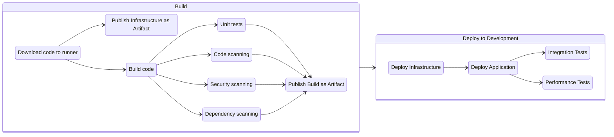
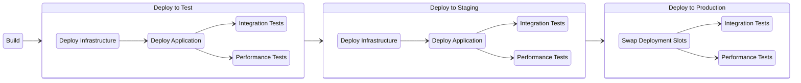

# GitHub Actions Samples

### [View all Roadmaps](https://github.com/nholuongut/all-roadmaps) &nbsp;&middot;&nbsp; [Best Practices](https://github.com/nholuongut/all-roadmaps/blob/main/public/best-practices/) &nbsp;&middot;&nbsp; [Questions](https://www.linkedin.com/in/nholuong/)

  
  !
  
 

## CI - Continuous Integration
With continuous integration, each time code is committed, changes are validated and merged to the main branch, and the code is packaged into a build artifact.

The [Continuous Integration Workflow](https://github.com/nholuongut/github-actions/blob/main/.github/workflows/continuous-integration.yml) is an example of a GitHub Workflow that automatically builds, validates, and generates a build artifact for the project whenever a commit is made to the main or a pull request branch.

## CI/CD - Continuous Integration & Continuous Delivery
When teams implement both continuous integration and continuous delivery (CI/CD), the build and deployment phases are automated. Code remains ready for production at any time. All teams must do is manually trigger the transition from develop to deploy—making the automated build artifact available for automatic deployment—which can be as simple as pressing a button.

The [Continuous Delivery Workflow](https://github.com/nholuongut/github-actions/blob/main/.github/workflows/continuous-delivery.yml) is an example of a GitHub Workflow that automatically performs the CI step and then deploys the build to a development environment.  A manual step is required to advance the deployment to each subsequent environment (QA, UAT, STAGE, PRODUCTION).

### Workflow

## Continuous Deployment
Continuous deployment takes this one step further.  When all testing for each environment (unit / integration / user acceptance) can be automated, then manual approval steps can be removed and the workflow of code from commit to production deployment can be fully automated.

### Workflow

I'm are always open to your feedback.  Please contact as bellow information:
### [Contact ]
* [Name: nho Luong]
* [Skype](luongutnho_skype)
* [Github](https://github.com/nholuongut/)
* [Linkedin](https://www.linkedin.com/in/nholuong/)
* [Email Address](luongutnho@hotmail.com)

# License
* Nho Luong (c). All Rights Reserved.